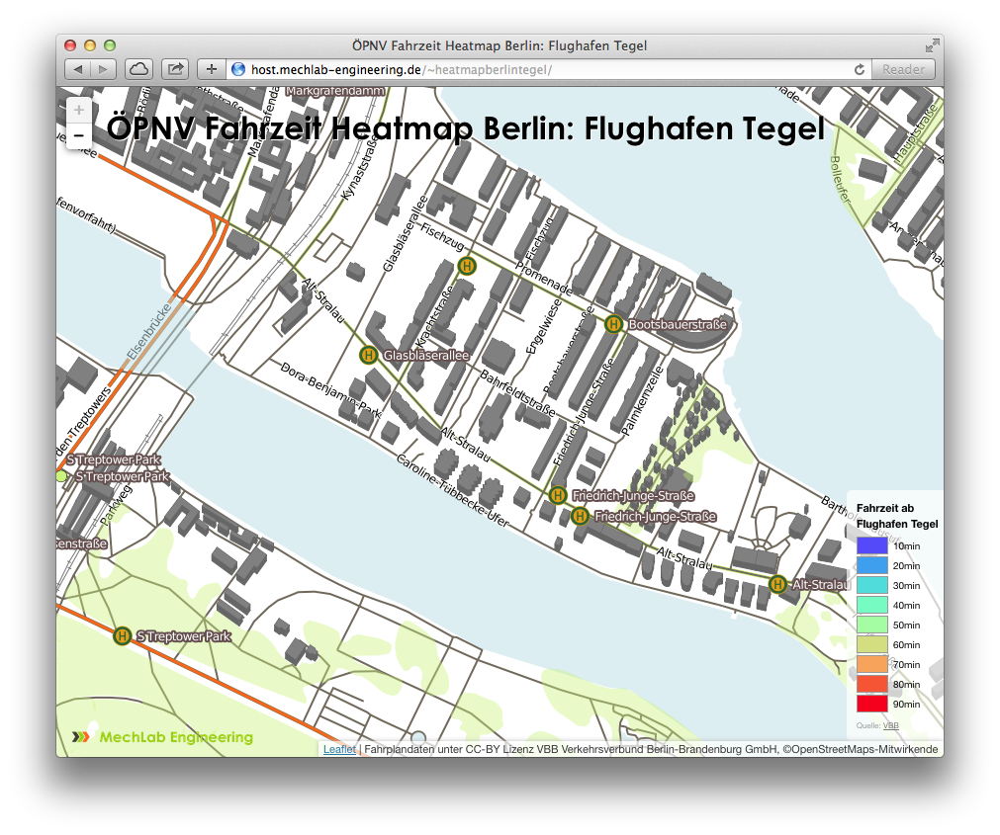

TileStream-Map
==============

Delivers a Map from .mbtiles file from local Server


## Get the Map online

1. Create a map with [TileMill](https://www.mapbox.com/tilemill/) and export as `.mbtiles` file.
2. copy local `.mbtiles` file to server with `scp <mymap>.mbtiles <user>@<server-adress>.de:/path/to/mymap/`
   * default path on server is `~/Documents/MapBox/tiles`
3. get [TileStream](https://github.com/mapbox/tilestream) up and running
   * `cd /usr/src`
   * `git clone https://github.com/joyent/node.git`
   * `cd node`
   * `git checkout v0.8.15` (not the newest one, but needed for tilestream)
   * `./configure`
   * `make`
   * `sudo make install`
   * get node package manager `curl https://npmjs.org/install.sh | sudo sh`
   * `git clone https://github.com/mapbox/tilestream.git`
   * `cd tilestream`
   * `npm install`
   * `./index.js start --tileHost="host.mechlab-engineering.de"`
4. clone the `index.html` to a server path, go to this directory
5. start a HTTP server to answer requests from web
    e.g. `python -m SimpleHTTPServer 8080`
    
Now your own Tile Server is up and running to provide a map online out of a `.mbtiles` file.



### Create public_html directory

1. Enable apache2 modul `a2enmod userdir`
2. Configure Apache module userdir in `/etc/apache2/mods-enabled/userdir.conf` as follows:
   ```
   <IfModule mod_userdir.c>
        UserDir public_html
        UserDir disabled root

        <Directory /home/*/public_html>
                AllowOverride All
                Options MultiViews Indexes SymLinksIfOwnerMatch
                <Limit GET POST OPTIONS>
                        Order allow,deny
                        Allow from all
                </Limit>
                <LimitExcept GET POST OPTIONS>
                        Order deny,allow
                        Deny from all
                </LimitExcept>
        </Directory>
   </IfModule>
   ```
3. `sudo adduser heatmapberlintegel`
4. `sudo adduser heatmapberlintegel www-data`
5. Create directory as user (not as root): `mkdir /home/$USER/public_html`
6. `chmod 755 /home/heatmapberlintegel`
7. Change group as root (substitute your username) and restart web server: `chgrp www-data /home/<username>/public_html`
8. `service apache2 restart`

Jetzt müsste die Karte unter [http://host.mechlab-engineering.de/~heatmapberlintegel/](http://host.mechlab-engineering.de/~heatmapberlintegel/) erreichbar sein

### Get the cronjob start the server

Create a `startserver.sh` file with

```
#!/bin/bash
echo "Starte Tilestream Server..."
DATE=`date +%Y-%m-%d-%H-%M`
/usr/local/bin/node /var/www/tilestream/index.js start --tileHost="host.mechlab-engineering.de" &> /var/www/tilestream/logs/${DATE}.txt &
echo "done"
```

and put it to `sudo crontab -e` with

`@reboot /var/www/tilestream/startserver.sh`

Done.
